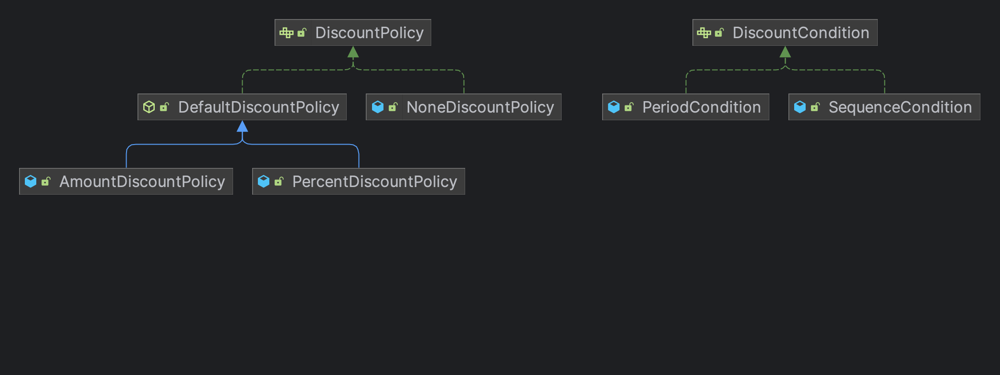
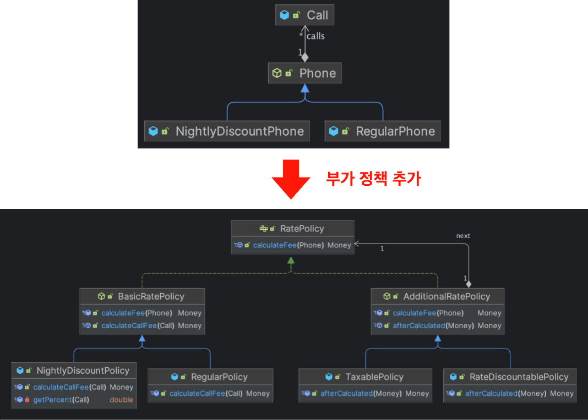

1. 책임, 협력, 역할에 대한 이해부터 데이터 중심 설계로 객체의 내부 구현부터 먼저 설계하게 되면 발생하는 문제점
2. 영화 에매 애플리케이션에 대한 이해를 먼저 시키고 책임 주도 설계, GARSP 이론을 설명하면서 영화 예매 애플리케이션이 어떻게 개발되었는지 이해시키려 하는 것
3. 추상화와 다형성을 통한 런타임 의존성, 동적 디스패치를 잘 활용하여 유연성을 가져야함을 강조한다. 

# 인덱스

1. 이해 가능한 코드란 그 동작이 우리의 예상에서 크게 벗어나지 않는 코드다.  
2. 객체 사이의 의존성을 완전히 없애는 것이 정답은 아니다. 객체지향 설계는 서로 의존하면서 협력하는 객체들의 공동체를 구축하는 것이다. 따라서 필요한 최소한의 의존성만 유지하고 불필요한 의존성을 제거해야 한다.
3. 객체를 인터페이스와 구현으로 나누고 인터페이스만을 공개하는 것은 객체 사이의 결합도를 낮추고 변경하기 쉬운 코드를 작성하기 위해 따라야 하는 가장 기본적인 설계 원칙이다.
4. 객체지향의 세계에서는 무생물 역시 스스로 행동하고 자기 자신을 책임지는 자율적인 존재로 취급해야 한다. 이를 의인화라고 부른다.
5. 객체의 경계 명확성이 객체의 자율성을 보장하기에, 내부와 외부를 확실하게 구분해야 한다.
6. 컴파일 시점 의존성과 런타임 의존성은 서로 다를수록 코드는 더 유연해지고 확장 가능해진다. 하지만 코드를 이해하기 어려워진다는 사실은 명심해야 한다.
7. 인터페이스 재사용할 목적이 아니라 구현을 재사용할 목적으로 상속을 사용하면 변경에 취약한 코드를 낳게 될 확률이 높다.
8. 컨텍스트 독립성
9. 겍체지향의 본질은 협력하는 객체들의 공동체를 창조하는 것이며, 협력을 구성하기 위해 적절한 객체를 찾고 적절한 책임을 할당하는 과정이 핵심이다.
10. 객체의 인터페이스는 무엇을 하는지 포현해야한다. 어떻게 수행하는 지를 노출해서는 안된다.
11. 응집도와 결합도를 변경의 관점에서 바라봐야 하며, 설계의 제 1원리인 캡슐화의 정도가 응집도와 결합도에 영향을 미치는 것을 명심해야 한다.
12. 데이터 중심 설계는 행동보다 데이터를 먼저 결정하고 협력이라는 문맥을 벗어나 고립된 객체의 상태에 초점을 맞추기 때문에 캡슐화를 위반하기 쉽고, 요소들 사이의 결합도가 높아지면, 코드를 변경하기 어려워진다.
13. 함께 초기화되는 속성을 기준으로 클래스를 분리해야 한다.
14. 설계에서 방황을 잃었다면 최대한 빠르게 목적한 기능을 수행하는 코드를 작성한 후에 코드 상에 명확하게 드러나는 책임들을 리팩토링하는 것이 좋은 방법일떄도 있다.
15. '메시지 전송'은 컴파일 시점에 결정된 객체간의 협력이고, '메서드 호출'은 런타임에 결정된 객체간의 협력이다. 즉, 추상화에 의존하는 컴파일 시점과 추상화를 구현한 구현체가 실제로 실행되는 런타임 시점의 차이이다.
16. 추상 데이터 타입은 타입을 추상화한 것이고, 클래스는 절차를 추상화한 것이다.
17. 타입 추상화를 기반으로 하는 추상 데이터 타입은 오퍼레이션을 기준으로 타입을 묶는 방법이라면 객체지향은 타입을 기준으로 오퍼레이션을 묶는 것이다.
18. 추상 데이터 타입과 객체지향의 유용성은 설계에 요구되는 변경의 압력이 '타입 추가'에 관한 것인지, 아니면 '오퍼레이션 추가'에 관한 것인지에 따라 달라진다.
    - 타입에 대한 변경은 추상 데이터 타입은 클라이언트 코드를 일일이 찾아 확인해야 하지만 객체지향은 새로운 클래스를 상속 계층 또는 구현에 추가하기만 하면 된다.
    - 오퍼레이션에 대한 변경은 객체지향은 상속 계층 또는 구현에 속하는 모든 클래스를 수정해야 하지만 추상 데이터 타입은 추가하기만 하면된다.
19. 변하는 것과 변하지 않는 것이 무엇인지를 이해하여 변경에 의한 파급효과를 피하는 것을 추상화의 목적으로 삼아야한다.

# 오브젝트

[종립님의 오브젝트 스터디 레포](https://github.com/johngrib/study-objects)를 가이드 삼아 테스트 코드 까지 학습한다.  

# 1장. 티켓 판매

- `Invitation` : 이벤트 당첨자에게 발송되는 초대장이며 티켓으로 교환할 수 있다.
  - 초대일자를 인스턴스 변수로 포함하는 간단한 클래스
- `Ticket`
- `Bag` : 관람객은 소지품을 보관할 용도로 가방을 항상 소지하고 있다고 가정한다. 
- `Audience` : 관람객을 의미하며, 가방을 소지한다.
- `TicketOffice` : 관람객에게 판매할 티켓과 티켓의 판매 금액이 보관되어 있으며, 초대장을 티켓으로 교환해주는 매표소이다.
  - 티켓의 목록과 판매 금액을 변수로 포함한다.
- `TicketSeller` : 판매원은 자신이 일하는 매표소에 의존하며, 티켓으로 교환해주거나 판매하는 역할을 수행한다.
- `Theater` : 관람객을 맞이하는 소극장이다.

`Theater.enter()`는 너무 많은 책임을 가지고 있다.  
소극장이 관람객의 가방을 뒤져 초대권을 확인하고 존재하면 티켓을 가방에 넣어주고, 없으면 가방에서 돈을 뺏어서 티켓을 넣어준다.  
그리고 이 티켓을 가져오는 행위도 판매원에게 묻지않고 매표소를 직접 가져와서 묻는다.  
즉, **관람객과 판매원이 소극장의 통제를 받는 수동적인 존재이기 때문에 이 입장(enter)이라는 행위를 이해하기 위해 관람객의 가방, 가방안에 있는 현금과 티켓, 초대권 그리고 판매원의 매표소까지 너무 많은 정보가 노출되어 있다는 점이다.**  
**그리하여 관람객과 판매원이 수정되면 소극장까지 영향을 받을 수 밖에 없다.**   
  
## 리팩토링하기

1. 판매원은 매표소를 노출하지 않도록 하고, 판매원이 매표소에서 티켓을 전달하며 관람객이 직접 초대권의 유무를 확인하고 티켓의 가격만큼 금액을 제출한다. [예제](https://github.com/jdalma/object/commit/f2eeafb9d98a04970109244d612757dd1018059c)
2. 관람객이 가방을 직접 뒤지지 않고 가방에게 초대권의 유무를 물어보고 티켓의 가격만큼 금액을 차감하도록 한다. [예제](https://github.com/jdalma/object/commit/b00e53a7d13f17ee2c6440dd1665bfc3e5f569f6)
3. 판매원이 매표소를 까서 직접 티켓을 가져오고 돈통에 돈을 넣기에 현재 매표소는 수동적인 클래스다. 
   1. [ ] 매표소에 관람객을 전달해서 의존성은 추가되지만 능동적인 클래스로 만드는 것이 좋을까?
   2. [x] 매표소가 관람객에 대한 의존성이 추가되진 않지만 판매원에게 제어되는 수동적인 클래스로 만드는 것이 좋을까? 

## 궁금한 점

1. TicketSeller와 TicketOffice의 의존 방향이 반대로 되어야 하지 않나? 판매원이 매표소를 알 것이 아니라 매표소가 판매원을 알아야하지 않나? 그냥 돈통이라는 의미인가?
2. 의인화를 통해 TicketSeller의 책임을 TicketOffice에 모두 전가하는 것은 어떤가? 그럼 TicketSeller는 제거될 수 있지 않나?

## 핵심

소극장에게 몰려있던 책임을 판매원과 관람객에게 책임을 분할하면서 캡슐화를 하였다.  
더 나아가 관람객에게 의존하던 가방에게도 책임을 나누어줬다.  
이때, 판매원에게 의존하던 매표소에게도 책임을 나누어주려 하였지만 매표소가 티켓을 전달하고 돈통에 돈을 증가시키는 책임을 가지게 하려면 관람객에 대한 불필요한 의존성이 추가되어 매표소는 그대로 두었다.  

# 2장. 영화 상영

## 영화 예매 시스템

'영화'는 영화에 대한 제목, 상영시간, 가격 정보와 같이 영화가 가지고 있는 기본적인 정보를 가리킨다.    
'상영'은 상영 일자, 시간, 순번 등을 가리키며 실제로 관객들이 영화를 관람하는 사건을 표현한다.  
영화는 하루 중 다양하 시간대에 걸쳐 한 번 이상 상영될 수 있다.  
그렇기에 소비자는 영화를 구매하는 것이 아니라 특정 시간에 상영되는 영화를 관람할 수 있는 권리를 구매하기 위해 돈을 지불한다.  
  
특정한 조건을 만족하면 요금을 할인받을 수 있다.  
- **할인 조건** : 가격의 할인 여부를 결정하며, `순서 조건`과 `기간 조건`의 두 종류로 나뉜다.
  - 순서 조건은 예를 들어, 매일 10번째로 상영되는 영화를 예매한 사용자들에게 할인 혜택을 제공하는 것
  - 기간 조건은 요일, 시작 시간, 종료 시간의 세 부분으로 구성되며 영화 시작 시간이 해당 기간안에 포함될 경우 요금을 할인한다.
    - 예를 들어, 매주 월요일 오전 10시부터 오후 1시 사이에 상영되는 모든 영화에 대해 할인 혜택을 적용할 수 있다.
- **할인 정책** : 할인 요금을 결정하며, `금액 할인 정책`과 `비율 할인 정책`이 있다.
  - 금액 할인 정책은 예매 요금에서 일정 금액을 할인해준다.
  - 비율 할인 정책은 정가에서 일정 비율의 요금을 할인해주는 방식이다.

영화별로 하나의 할인 정책만 할당할 수 있으며, 할인 조건은 순서 조건과 기간 조건을 여러 개 섞는 것도 가능하다.  
할인을 적용하기 위해서는 할인 조건과 할인 정책을 함께 조합해서 사용한다.  

1. 사용자의 예매 정보가 할인 조건 중 하나라도 만족하는지 검사한다.
2. 할인 조건을 만족할 경우 할인 정책을 이용해 할인 요금을 계산한다.
3. 할인 정책은 적용돼 있지만 할인 조건을 만족하지 못하는 경우나 아예 할인 정책이 적용돼 있지 않은 경우에는 요금을 할인하지 않는다.

## 구현하기

- 영화 : `Movie`
- 상영 : `Screening`
- 할인정책 : `DiscountPolicy`
  - 금액할인정책 : `AmountDiscountPolicy`
  - 비율할인정책 : `PercentDiscountPolicy`
- 할인조건 : `DiscountCondition`
  - 순번조건 : `SequenceCondition`
  - 기간조건 : `PeriodCondition`
- 예매 : `Reservation`

상영이 `reserve(customer, audienceCount)`를 통해 예약을 생성한다. 예약 금액을 구할 때는 영화에게 영화 금액을 요청한다.  
할인정책은 여러 개의 할인조건을 주입받아 할인조건에 부합하는 상영인지 확인하고 부합한다면 자신을 상속한 자식에게 할인금액을 계산하도록 메시지를 전송한다.  

## 핵심

추상 클래스와 인터페이스, 상속과 합성에 대한 트레이드 오프를 고민하는 것이 이번 장의 핵심이다.   

할인정책은 추상 클래스를 사용하여 템플릿 메소드 패턴으로 자식 클래스들을 추가할 수 있었지만, NonDiscountPolicy가 추가되면서 DiscountPolicy는 인터페이스로 변경하고 DefaultDiscountPolicy를 추상클래스로 추가하였다.
하지만 영화와 할인정책을 해결할 수 있는 구조적 설계의 방법은 인터페이스를 사용한 방법말고 Movie를 추상클래스로 바꿔서 Policy에 대한 구현체들을 Movie의 자식 클래스로 변경하여 할인금액을 구하는 메소드만 템플릿 메소드 패턴으로도 해결할 수 있다.  

# 3장. 협력, 책임, 역할

> 협력이 책임을 이끌어내고 책임이 협력에 참여할 객체를 결정한다.  
> 메시지는 외부의 객체가 요청하는 무언가를 의미하기 때문에 메시지를 먼저 식별하면 무엇을 수행할지에 초점을 맞추는 인터페이스를 얻을 수 있다.  
> 협력 → 책임 → 메시지 → 역할 → 객체 → 클래스(행동) → 클래스(상태)

많이 하는 실수가 객체의 행동이 아니라 상태에 초점을 맞추어 상태를 먼저 결정하고, 그 후에 상태에 필요한 행동을 결정하는 것이다.  
이런 방식은 객체의 내부 구현이 공개 인터페이스에 노출되도록 만들기 때문에 캡슐화를 저해하며 변경의 여파가 해당 객체의 의존하는 클라이언트까지 퍼지게 된다.  
객체의 상태는 구현에 속하며, 불안정하기 때문에 변하기 쉽기에 **상태를 객체 분할의 중심축으로 삼으면 구현에 관한 세부사항이 객체의 인터페이스에 스며들게 되어 캡슐화의 원칙이 무너진다.**
  
**최대한 구현에 대한 결정을 뒤로 미루면서 객체의 행위를 고려하기 위해서는 항상 협력이라는 문맥 안에서 객체를 생각해야 한다.**  

## 협력이란?

협력은 객체를 설계하기 위한 구체적인 문맥을 제공한다.  
어떤 요청을 해결하기 위해 두 개 이상의 객체가 상호작용을 통해 더 큰 책임을 수행하는 것이다.  
이 협력을 설계할 때는 객체를 서로 분리된 인스턴스가 아닌 설계자가 생각하는 문제 해결 컨텍스트 내에서 협력하는 파트너라고 인식해야 한다.  
  
객체란 상태와 행동을 함께 캡슐화하는 실행 단위다.  
그렇다면 객체가 가질 수 있는 상태와 행동을 어떤 기준으로 결정해야 할까?  
객체를 설게할 때 어떤 행동과 상태를 할당했다면 그 이유는 무엇인가?  
  
객체가 존재하는 이유는 협력에 필요한 적절한 행동을 보유하고 동시에 어떤 협력에 참여하고 있기 때문이다.  
**결론적으로 객체의 행동을 결정하는 것은 객체가 참여하고 있는 협력이다.**  
객체의 행동을 결정하는 것이 협력이라면 객체의 상태를 결정하는 것은 행동이다.  
  
만약 클래스가 (캡슐화를 위반하는) 접근자와 수정자를 가지게 되는 경우라면 협력에 관해 고민하지 않은 증거이다.  
  
> 상태는 객체가 행동하는 데 필요한 정보에 의해 결정되고 행동은 협력 안에서 객체가 처리할 메시지로 결정된다.  
> 결과적으로 객체가 참여하는 협력이 객체를 구성하는 행동과 상태를 모두 결정한다.  
> **따라서 협력은 객체를 설계하는 데 필요한 일종의 `문맥`을 제공한다.**

## 책임이란?

객체를 설계하기 위한 문맥인 협력이 갖춰졌다면 협력에 필요한 행동을 수행할 수 있는 적절한 객체를 찾는 것이다.  
객체의 책임은 객체가 `무엇을 할 수 있는가?`와 `무엇을 알고 있는가?`로 구성된다.  

- **하는 것**
  - 객체를 생성하거나 계산을 수행하는 등의 스스로 하는 것
  - 다른 객체의 행동을 시작시키는 것
  - 다른 객체의 활동을 제어하고 조절하는 것
- **아는 것**
  - 사적인 정보에 관해 아는 것
  - 관련된 객체에 관해 아는 것
  - 자신이 유도하거나 개선할 수 있는 것에 관해 아는 것

이때까지의 예로 설명해보자.

1. Screening이 reserve 메시지를 수신하고 movie를 인스턴스 변수로 포함하는 이유는 협력 안에서 영화를 예매할 책임을 수행해야 하기 때문이다.
2. Movie가 calculateMovieFee 메시지를 수신할 수 있고 fee와 discountPolicy를 속성으로 가지는 이유는 협력 안에서 가격을 계산할 책임을 할당받았기 때문이다.

> 객체지향 설계에서 가장 중요한 것은 `책임`이다.

## 역할이란?

객체가 어떤 특정한 협력 안에서 수행하는 책임의 집합을 역할이라고 부른다.  
이전에 보았던 영화를 *예매하라* 라는 메시지를 처리하는 객체를 고민할 때 Screening을 선택한 것이 **역할에 대한 결정을 먼저하고 객체를 선택하는 방식으로 진행되어야 한다.**  
  
`예매하라 → 가격을 계산하라 → 할인 요금을 계산하라` 이 순서의 메시지를 응답할 수 있는 역할을 정하는 것이다.  
역할을 메시지를 응답하기 위한 여러 객체들을 포괄하는 **추상화** 라고 생각하면 좋다.  

# 5장. 책임 할당하기

책임 할당 과정은 일종의 트레이드 오프 활동이다.  
동일한 문제를 해결할 수 있는 다양한 책임 할당 방법이 존재하며, 어떤 방법이 최선인지는 상황과 문맥에 따라 달라진다.  
따라서 올바른 책임을 할당하기 위해서는 다양한 관점에서 설계를 평가할 수 있어야 한다.

1. 데이터보다 행동을 먼저 결정하라.
2. 협력이라는 문맥 안에서 책임을 결정하라.

협력을 시작하는 주체는 메시지 전송자이기 때문에 적합한 책임이란 메시지 수신자가 아니라 메시지 전송자에게 적합한 책임을 의미한다.  
객체가 메시지를 선택하는 것이 아니라 메시지가 객체를 선택해야 한다.

## GARSP (General Responsibility Assignment Software Pattern) 패턴

일반적인 책임 할당을 위한 소프트웨어 패턴이며, 객체에게 책임을 할당할 때 지침으로 삼을 수 있는 원칙들을 패턴 형식으로 정리한 것이다.

1. **도메인 개념에서 출발하기**
2. **정보전문가에게 책임을 할당하다** (메시지를 전송할 객체는 무엇을 원하는가? 메시지를 수신할 적합한 객체는 누구인가?)
3. **높은 응집도와 낮은 결합도** (Screening이 할인조건과 할인금액을 확인하는 것보다 Movie가 확인하는 것이 더 나은 이유)
4. **창조자에게 객체 생성 책임을 할당하라** (CREATOR 패턴)
5. **다형성을 통해 분리하기** (POLYMORPHISM 패턴)
7. **캡슐화로 변경으로부터 보호하기** (PROTECTED VARIATIONS 패턴)

# 6장. 메시지와 인터페이스

구현에 집중하지 말고 문맥안에서 이루어지는 협력, 그 협력에 맞는 역할, 그 역할에 맞는 책임이 중요하다고 강조해왔다.  
더 세부적으로 보면 **책임은 객체가 수신할 수 있는 메시지로 기반이 된다.**  
즉, 객체지향 애플리케이션의 가장 중요한 재료는 클래스가 아니라 객체들이 주고받는 `메시지`다.

> 메시지 전송 표기법 `condition.isSatisfiedBy(screening)`  
> condition : 수신자  
> isSatisfiedBy : 오퍼레이션명  
> screening : 인자
  
객체가 수신할 수 있는 메시지가 객체의 퍼블릭 인터페이스와 그 안에 포함될 오퍼레이션을 결정하기에, **객체의 퍼블릭 인터페이스가 객체의 품질을 결정하기 때문에 결국 메시지가 객체의 품질을 결정한다고 볼 수 있다.**  
퍼블릭 인터페이스의 품질에 영향을 미치는 원칙과 기법이 있다.  

1. **디미터 법칙** : 객체의 내부 구조에 강하게 결합되지 않도록 클라이언트에게 구현을 노출하지 마라('낯선 자에게 말하지 말라' 또는 '오직 인접한 이웃하고만 말하라', '오직 하나의 도트만 사용하라')
2. **묻지 말고 시켜라** : 메시지 수신자의 상태를 이용해 수신자 외부에서 의사결정 하지마라. 상태를 묻는 오퍼레이션을 행동으로 요청하는 오퍼레이션으로 대체함으로써 인터페이스를 향상 시켜라.
3. **의도를 드러내는 인터페이스** : 구현과 관련된 모든 정보를 캡슐화하고 객체의 퍼블릭 인터페이스에는 협력과 관련된 클라이언트의 의도만을 표현해야 한다는 것이다.
4. **명령 쿼리 분리 원칙**

> **원칙의 함정**  
> 1. 자바 8의 Stream API는 객체 내부의 구조가 노출되지 않기에 디미터의 법칙을 위반하지 않는다. 또한 객체가 아닌 자료구조를 표현하는 클래스에게 디미터 법칙을 적용할 필요가 없다.
> 2. 맹목적으로 '묻지 말고 시켜라' 원칙을 지키다보면 서로 상관없는 책임들이 뭉쳐있는 클래스가 탄생할 수 있다.
> 
> 소프트웨어 설계에 법칙이란 존재하지 않는다. 원칙을 맹신하지 말고 상황을 판단할 수 있는 안목을 길러야 한다.

## 명령 쿼리 분리 원칙 (CQS)

어떤 절차를 묶어 호출 가능하도록 이름을 부여한 기능 모듈을 **루틴(routine)** 이라고 부른다.  
루틴은 다시 **프로시저** 와 **함수** 로 구분할 수 있다.  
프로시저는 정해진 절차에 따라 내부의 상태를 변경하며, 함수는 어떤 절차에 따라 필요한 값을 계산해서 반환하는 것이다.  

1. 프로시저는 부수효과를 발생시킬 수 있지만 값을 반환할 수 없다.
2. 함수는 값을 반환할 수 있지만 부수효과를 발생시킬 수 었다.

**명령(Command)** 과 **쿼리(Query)** 는 객체의 인터페이스 측면에서 프로시저와 함수를 부르는 또 다른 이름이다.  
명령은 객체의 상태를 수정하는 오퍼레이션이며, 쿼리는 객체와 관련된 정보를 반환하는 오퍼레이션이다.  
따라서 **개념적으로 명령은 프로시저와 동일하고, 쿼리는 함수와 동일하다.**  
  
핵심은 **오퍼레이션은 명령인 동시에 쿼리여서는 안된다는 것이다.**   

1. 객체의 상태를 변경하는 명령은 반환값을 가질 수 없다.
2. 객체의 정보를 반환하는 쿼리는 상태를 변경할 수 없다.

> 부수효과를 발생시키지 않는 것만을 함수로 제한함으로써 소프트웨어에서 말하는 '함수'의 개념이 일반 수학에서의 개념과 상충되지 않게 한다.  
> 명령과 쿼리간의 명확한 구분을 유지해야 한다. **이런 스타일의 인터페이스를 사용함으로써 객체의 캡슐화와 다양한 문맥에서의 재사용을 보장할 수 있다.**

  
[명령과 쿼리의 두 가지 역할을 동시에 수행하는 `event.isSatisfied(RecurringSchedule schedule)` 메서드](https://github.com/jdalma/object/blob/main/src/main/java/_06_command_query/Event.java#L21)가 명령과 쿼리를 뒤섞었을 때 발생하는 대표적인 예제다.  
명령과 쿼리를 분리하게 되면 **코드는 예측 가능하고 이해하기 쉬우며 디버깅이 용이한 동시에 유지보수가 수월해질 것이다.**  
  
부수효과를 이야기하면 빠질 수 없는 것이 **참조 투명성** 이 있다.  
참조 투명성이란 **어떤 표현식 e가 있을 때 e의 값으로 e가 나타나는 모든 위치를 교체하더라도 결과가 달라지지 않는 특성** 을 말한다.  
수학에서 함수는 동일한 입력에 항상 동일한 값을 반환하기 때문에 수학의 함수는 참조 투명성을 만족시키는 이상적인 예다.  
  
**수학에서의 함수는 어떤 값도 변경하지 않기 때문에 부수효과가 존재하지 않는다. 그리고 부수효과가 없는 불변의 세상에서는 모든 로직이 참조 투명성을 만족시킨다. 따라서 불변성은 부수효과의 발생을 방지하고 참조 투명성을 만족시킨다.**   
하지만 객체지향 패러다임이 객체의 상태 변경이라는 부수효과를 기반으로 하기 때문에 참조 투명성은 예외에 가깝다. 하지만 CQS 원칙을 사용하면 이 문제를 조금이나마 해결할 수 있다.  

# 7장. 객체 분해

대표적인 설계 실수로 하향식 접근법을 사용하여 추상적인 최상위 문장부터 시작하여 좀 더 세분화된 절차로 구체화해나가는 방법이다.

1. 너무 이른 시기에 함수들의 실행 순서를 고정시키기 때문에 유연성과 재사용성이 저하된다.
2. 상위 함수를 분해하는 과정에서 발생하는 하위 함수는 상위 함수가 강요하는 문맥안에서만 의미를 가지기 때문에 유연하지 못하다.
3. 데이터 형식이 변경될 경우 파급효과를 예측할 수 없다.
4. 입력 방법과 출력 양식을 비즈니스 로직과 함께 고민하기에 비즈니스 로직이 사용자 인터페이스와 강하게 결합된다.
5. 기능 추가나 요구사항 변경으로 인해 메인 함수를 빈번하게 수정해야 한다.

하향식 접근법은 실행 순서나 조건, 반복과 같은 제어구조를 미리 결정하지 않고는 분해를 진행할 수 없기 때문에 유연하지 않는 중앙집중 제어 스타일의 형태를 띨 수 밖에 없다.  
커다란 소프트웨어를 설계하기 보다는 작은 프로그램과 개별 알고리즘을 위해서만 유용한 패러다임으로 남아있다.  
  
그렇기에 **기능을 기반으로 시스템을 분해하는 것이 아니라 변경의 방향에 맞춰 시스템을 분해해야 한다.**  
즉, **'직원의 급여를 계산한다.' 라는 하나의 커다란 절차를 이용해 사고하기 보다는 '직원'과 '급여'라는 추상적인 개념들을 머릿속에 떠올린 후 이들을 이용해 `계산`에 필요한 절차를 생각해야 한다.**  
  
**정보 은닉** 을 통해 모듈은 변경될 가능성이 있는 비밀을 내부로 감추고, 잘 정의되고 쉽게 변경되지 않을 퍼블릭 인터페이스를 외부에 제공해서 `내부의 비밀`에 함부로 접근하지 못하게 한다.  
모듈 내부에 꽁꽁 숨겨야할 요소는 **복잡성** 과 **변경 가능성** 이다.  

# 8장. 의존성 관리하기 + 9장. 유연한 설계

협력을 위해서는 의존성이 필요하지만 과도한 의존성은 애플리케이션을 수정하기 어렵게 만든다.  
핵심은 협력을 위해 필요한 의존성은 유지하면서도 변경을 방해하는 의존성은 제거하는 것이다.
  
## 의존성 전이

PeriodCondition이 Screening에 의존할 경우 PeriodCondition은 Screening이 의존하는 대상에 대해서도 자동적으로 의존하게 된다는 것이다.  
따라서 Screening이 Movie, LocalDateTime, Customer에 의존하기 때문에 PeriodCondition 역시 간접적으로 의존하게 된다.  
  
그렇다고 모든 경우에 의존성이 전이되는 것은 아니며, 변경의 방향과 캡슐화의 정도에 따라 달라진다.  
이 경우에는 Screening이 효과적으로 캡슐화하고 있다면 PeriodCondition에도 변경이 전파되지 않을 수 있다.  

## 컨텍스트 독립성

클래스가 특정한 문맥에 강하게 결합될수록 다른 문맥에서 사용하기는 더 어려워진다.  
클래스가 사용될 특정한 문맥에 대해 최소한의 가정만으로 다른 문맥에서 재사용하기가 더 수월해진다.  
이를 **컨텍스트 독립성** 이라고 부른다.  
  
설계가 유연해지기 위해서는 재사용성을 높이기 위해 가능한 자신이 실행될 컨텍스트에 대한 구체적인 정보를 최대한 적게 알아야 한다.  
어떤 의존성이 다양한 환경에서 클래스를 재사용할 수 없도록 제한한다면 그 의존성은 바랍직하지 못한 것으로 볼 수 있다.  
즉, 컨텍스트 독립적인 의존성은 바람직하지만 특정한 컨텍스트에 강하게 결합된 의존성은 바람직하지 않은 의존성이다.  

## FACTORY 추가하기

유연하고 재사용 가능한 설계를 원한다면 객체를 생성하는 책임과 객체를 사용하는 책임을 분리하여야 한다.  
  
Movie가 의존하는 DiscountPolicy와 DiscountPolicy가 의존하는 DiscountCondition에 대한 생성 책임은 현재 클라이언트에게 있다.  
만약 클라이언트도 특정한 컨텍스트에 묶이지 않기를 바랄 땐 **생성과 사용을 분리하기 위해 특화된 FACTORY를 적용할 수 있다.**  
즉, 클라이언트는 사용과 관련된 책임만 가지게하고 FACTORY는 생성과 관련된 책임을 가지게하도록 분리하는 것이다.   

## 순수한 가공물에게 책임 할당하기

INFORMATION EXPERT 패턴에 따라 책임을 할당한 결과가 바람직하지 않을 경우 대안으로 PURE FABRICATION 패턴을 사용한다.  
**어떤 객체가 책임을 수행하는 데 필요한 많은 정보를 가졌지만 해당 책임을 할당할 경우 응집도가 낮아지고 결합도가 높아진다면 가공의 객체를 추가해서 책임을 옮기는 것을 고민하라.**  
  
도메인 모델에서 출발해서 설계에 유연성을 추가하기 위해 책임을 이리저리 옮기다 보면 많은 '순수한 가공물'을 추가하게 된다.  
FACTORY도 객체의 생성 책임을 할당할만한 도메인 객체가 존재하지 않을 때 선택할 수 있는 PURE FABRICATION이다.  

## 의존성 역전 원칙과 패키지

Movie를 정상적으로 컴파일 하기 위해서는 DiscountPolicy 클래스가 필요하다. (컴파일타임 의존성)  
그렇기에 Movie가 의존하는 DiscountPolicy의 추상화 계층은 의존성 역전 원칙에 따라 Movie와 같은 패키지에 존재해야 한다.  
즉, **추상화를 별도의 독립적인 패키지가 아니라 클라이언트가 속한 패키지에 포함시켜야 한다.**  
그리고 함께 재사용될 필요가 없는 클래스들은 별도의 독립적인 패키지에 모아야 한다.   
  
의존성 역전 원칙에 따라 상위 수준의 협력 흐름을 재사용하기 위해서는 추상화가 제공하는 인터페이스의 소유권 역시 역전시켜야 한다.  
  
이렇게 분리되면 Movie를 다른 컨텍스트에서 재사용하기 위해서는 Movie가 포함된 패키지만 재사용하면 된다.  
이 기법을 `SEPARATED INTERFACE 패턴` 이라고 한다. [참고](https://hudi.blog/separated-interface-pattern/)

# 10장. 상속과 코드 재사용

1. **DRY 원칙** : 중복 코드는 변경을 방해한다. 요구사항이 변경됐을 때 두 코드를 함께 수정해야 한다면 이 코드는 중복이다.

## 통화 요금 계산

- `Call` : 통화 시작 시간과 통화 종료 시간을 소유하며, 시작과 종료 시간을 계산해주는 책임을 가진다.
- `RegularPhone` : 단위요금, 단위시간, 여러 개의 Call을 소유하며, 요금 계산에 대한 책임을 가진다.
- `NightlyDiscountPhone` : 심야 요금 할인 기준으로 요금 계산에 대한 책임을 가진다.

일반 요금 계산에 대한 책임을 소유하는 Phone과 심야 요금 할인에 대한 계산과 일반 요금 계산에 대한 책임을 둘 다 가지는 NightlyDiscountPhone은 서로 중복된 기능이 있다.   
만약 세금을 적용하기 위한 기능을 추가해야 한다면 두 곳 모두 수정해야한다.  
중복 코드를 제거할 수 있는 방법은 무엇이 있을까?  

1. [ ] **타입 코드 사용하기** : 타입 코드의 값에 따라 로직을 분기시켜 두 클래스를 하나로 합치는 것도 방법이다.
   - 하지만 타입 코드를 사용하는 자체가 이 클래스는 낮은 응집도와 높은 결합도를 가지고 있다는 힌트가 된다. 
2. [ ] **직접 상속하기** : NightlyDiscountPhone가 Phone을 상속하는 것이다.
   - 하지만 개발자가 재사용을 위해 상속 계층 사이에 무수히 많은 가정을 세웠을 수 있다.
   - 그 가정은 코드를 이해하기 어렵게 만들뿐만 아니라 직관에도 어긋나며 자식과 부모의 결합도가 높아진다.
   - 세금 계산에 대한 중복 로직이 사라지지도 않으며, `super` 참조를 이용해 부모 클래스의 메서드를 직접 호출하게 되면 두 클래스는 강하게 결합되어 있다는 뜻이다.
3. [x] **추상화에 의존하기**
   - 어떤 메서드가 유사하게 보인다면 차이점을 메서드로 추출하라. 메서드 추출을 통해 특정 메서드들을 동일한 형태로 보이도록 만들 수 있다.
   - 부모 클래스의 코드를 하위로 내리지 말고 자식 클래스의 코드를 상위로 올려라. 
   - 부모 클래스의 구체적인 메서드를 자식 클래스로 내리는 것보다 자식 클래스의 추상적인 메서드를 부모 클래스로 올리는 것이 재사용성과 응집도 측면에서 더 좋은 결과를 얻을 수 있다.

## 취약한 기반 클래스 문제

상속을 사용하면 부모 클래스의 변경에 의해 자식 클래스가 영향을 받는 현상을 **취약한 기반 클래스 문제** 라고 부른다.  
이 문제는 상속을 사용한다면 피할 수 없는 객체지향 프로그래머의 근본적인 취약성이다.  
NightlyDiscountPhone이 Phone을 직접 상속하여 중복 로직을 제거하려 해보았지만 실패한 사례를 떠올릴 수 있다.  
  
1. 상속 관계를 추가할수록 전체 시스템의 결합도가 높아지며, 자식 클래스가 부모 클래스의 구현 세부사항에 의존하도록 만들기 때문에 캡슐화를 약화시킨다.  
2. 객체지향의 기반은 퍼블릭 인터페이스로 캡슐화를 적용하여 변경의 통제가 가능하지만, 상속은 부모 클래스의 변경으로 자식 클래스들이 요동칠 수 밖에 없다.
3. Stack이 Vector를 상속한 것과 Properties가 Hashtable을 상속한것 처럼 잘못된 상속은 불필요한 인터페이스 상속 문제가 발생하여 부모 클래스의 메서드가 자식 클래스의 내부 구조에 대한 규칙을 깨트릴 수 있다.
4. 메서드 오버라이딩의 오작용 문제가 발생하여 리스코프 치환 원칙을 어기기 쉽다. 

# 11장. 합성과 유연한 설계

상속과 합성은 코드 재사용이라는 동일한 목적을 가진다는 점을 제외하면 구현 방법부터 변경을 다루는 방식에 이르기까지 모든 면에서 도드라진 차이를 보인다.

- **상속** `is-a` 관계
  - 부모 클래스와 자식 클래스를 연결해서 부모 클래스안에 구현된 코드 자체를 재사용
  - 부모 클래스와 자식 클래스 사이의 의존성이 컴파일 타임에 해결됨
- **합성** `has-a` 관계
  - 합성에 포함되는 객체의 퍼블릭 인터페이스, 부분 객체의 코드를 재사용
  - 두 객체 사이의 의존성이 런타임에 해결됨
  - 위임도 합성에 포함된다.
  - 컴파일 의존성에 속박되지 않고 다양한 방식의 런타임 의존성을 구성할 수 있다

10장의 예제 기본 정책에 **세금 정책, 기본 요금 할인 정책을 추가하는 `부가 정책`** 을 합성을 이용하여 추가해보면 상속에 비해 유연하다는 것을 알 수 있다.  

추상 클래스로 기본 요금, 심야 요금 할인을 구현했었지만, 부가 정책이 추가되면서 조합이 가능해야 하기에 위와 같이 수정되었다.  
1. `BasicRatePolicy` : 기본 요금, 심야 요금 할인에 대한 중복 코드를 가지는 추상 클래스이며, 기존의 Phone 클래스와 동일하다.
   - `calculateCallFee`에 대한 구현 책임이 있다.
2. `AdditionalRatePolicy` : 부가 정책에 대한 추상 클래스이며, 부가 정책은 프록시처럼 작동하며 RatePolicy 타입이라면 다음 호출 타겟으로 주입 가능하다.
   - `afterCalculated`에 대한 구현 책임이 있다.

## 믹스인

상속과 클래스를 기반으로 하는 재사용 방법을 사용하면 구현에 의존하게 되므로 부모와 자식간에 결합도가 높아져 변경하기 어려운 코드를 얻게되는 것을 깨닫았다.  
구체적인 코드를 재사용하면서도 낮은 결합도를 유지할 수 있는 유일한 방법은 **재사용에 적합한 추상화를 도입** 하는 것이다.  
  
**믹스인** 은 객체를 생성할 때 코드 일부를 클래스 안에 섞어 넣어 재사용하는 기법을 가리키는 용어다.  
합성이 실행 시점에 객체를 조합하는 재사용 방법이라면 믹스인은 컴파일 시점에 필요한 코드 조각을 조합하는 재사용 방법이다.  
  
상속과 유사한 것처럼 보이겠지만 상속의 진정한 목적은 자식 클래스를 부모 클래스와 동일한 개념적인 범주로 묶어 `is-a`관계를 만들기 위한 것이다.  
반면 믹스인은 말 그대로 코드를 다른 코드안에 섞어 넣기 위한 방법이다.  
스칼라의 트레이트가 대표적이다. 이 트레이트는 **쌓을 수 있는 변경** 이라고도 불린다.  
